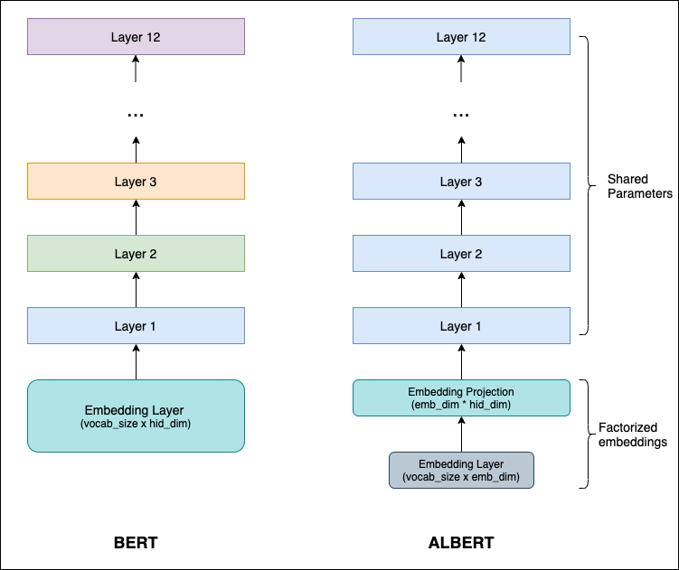
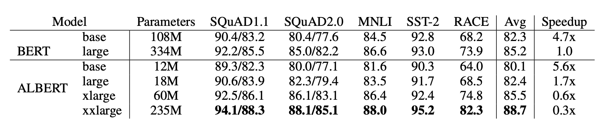
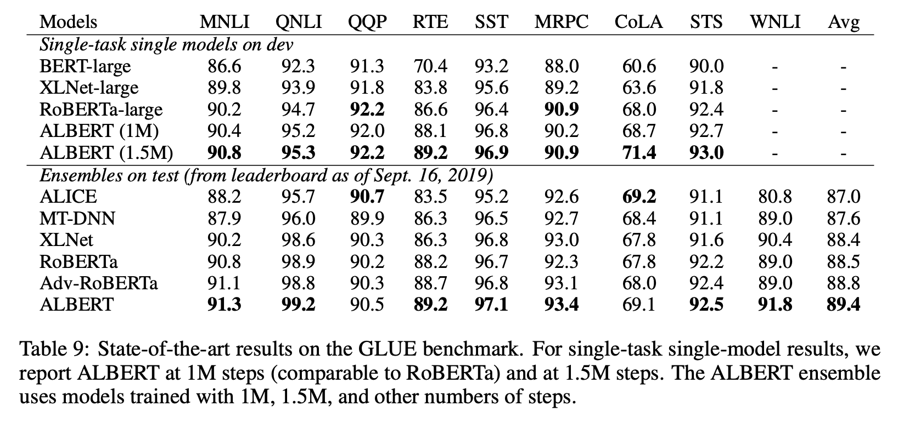
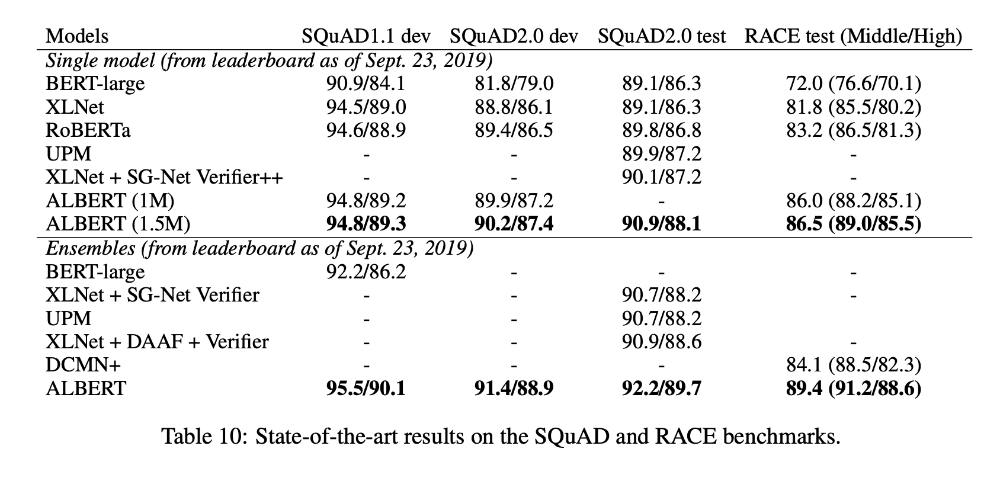
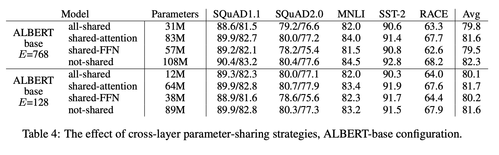
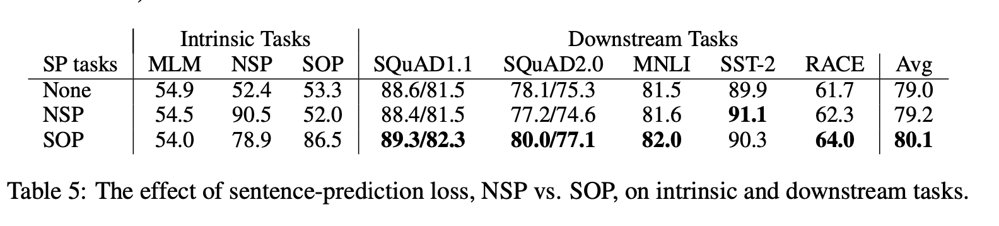

# ALBERT

Research paper link: https://arxiv.org/pdf/1909.11942.pdf

Paper Title: **`ALBERT: A Lite BERT for Self-Supervised Learning of Language Representations`**

## Aim

As the model increases it becomes harder to train and manage the model due to GPU/TPU memory limitations and longer training times. How to reduce the model size without comprimising on model performance?

## Key points

Two parameter reduction techniques to lower memory consumption and increasing the training speed.

- `Cross-layer parameter sharing`: Instead of using different parameters for each of the layer in the model, all the parameters `(Attention, FFN)` are shared between all the layers. Though sharing all the parameters hurts the performance on downstream tasks, the impact is less severe with a benefit of reducing the model size.

- `Factorized embedding parameterization`: By decomposing the large vocabulary embedding matrix into two small matrices, the size of the hidden layers from the size of vocabulary embedding is separated. This separation makes it easier to grow the hidden size without significantly increasing the parameter size of the vocabulary embeddings.

    Example:

    ```
    num_vocabulary = 30000
    vocab_emb_dim = 512
    num_parameters = 30000 * 512

    # if the hidden size is changed to 2048, then
    vocab_emb_dim = 2048
    num_parameters = 30000 * 2048 = 61440000
    ```

    #### Proposed

    ```
    num_vocabulary = 30000
    fixed_vocab_dim = 128
    hid_dim = 512
    num_parameters = 30000 * 128 + 128 * 512

    # if the hidden size is changed to 2048, then
    vocab_emb_dim = 2048
    num_parameters = 30000 * 128 + 128 * 2048 = 4102144
    ```
    #### Reduction in num_parameters = `93%`

A new objective to model inter-sentence coherence.

- `Sentence-Order Prediction (SOP)`: SOP primary focuses on inter-sentence coherence and is designed to address the ineffectiveness of the next sentence prediction (NSP) loss proposed in the original BERT. The task is to predict whether second segment follows the first segment or not. The major difference from NSP is: For negative samples, the segment is not chosen from a random document. Instead only the order of segments is swapped which are from the same document.

The model architecture looks like:




## Results

- 18x fewer parameters than BERT-large
- Trained 1.7x faster
- Got SOTA results on GLUE, RACE and SQUAD during its release
    - RACE: 89.4% [45.3% improvement]
    - GLUE Benchmark: 89.4
    - SQUAD 2.0 F1-score: 92.2








## Ablation Studies

### Effect of Parameter sharing

Comparision of different kinds of parameter sharing is done. The all-shared strategy (ALBERT-style), the not-shared strategy (BERT-style), and intermediate strategies in which only the attention parameters are shared (but not the FNN ones) or only the FFN parameters are shared (but not the attention ones).



The all-shared strategy hurts performance under both conditions, but it is less severe for E = 128 (- 1.5 on Avg) compared to E = 768 (-2.5 on Avg). In addition, most of the performance drop appears to come from sharing the FFN-layer parameters, while sharing the attention parameters results in no drop when E = 128 (+0.1 on Avg), and a slight drop when E = 768 (-0.7 on Avg).

### Effect of Embedding Factorization

Non-shared condition (BERT-style), larger embedding sizes give better performance, but not by much. Under the all-shared condition (ALBERT-style), an embedding of size `128` appears to be the best.


### Effect of Sentence-Order Prediction (SOP)

Comparision is done using three experimental conditions for the additional inter-sentence loss: none (XLNet- and RoBERTa-style), NSP (BERT-style), and SOP (ALBERT-style), using an ALBERT- base configuration.



The SOP loss appears to consistently improve downstream task performance for multi-sentence encoding tasks.

## My Observations

- Although there is a slight improvement in training speed, inference time is not reduced by much.

- SOP objective is very similar to the StructBERT objective (where the predict the whether a pair of segments follow, swapped or random to each other). Which shows that Sentence order prediction is important for the downstream tasks containing multiple sentences. Whether the SOP objective is better than Structural Sentence Objective or not needs to further evaluated.

- Impact of distillation on ALBERT (which can reduce even further parameters and also computation time) needs to be explored.


### References

- [Albert paper visual summary](https://amitness.com/2020/02/albert-visual-summary/)