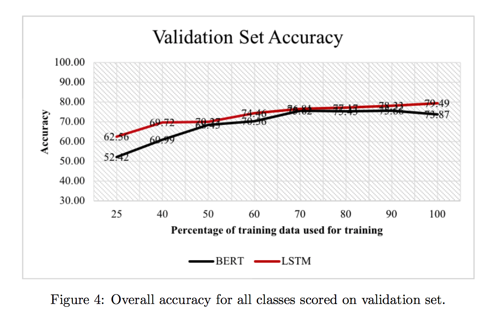
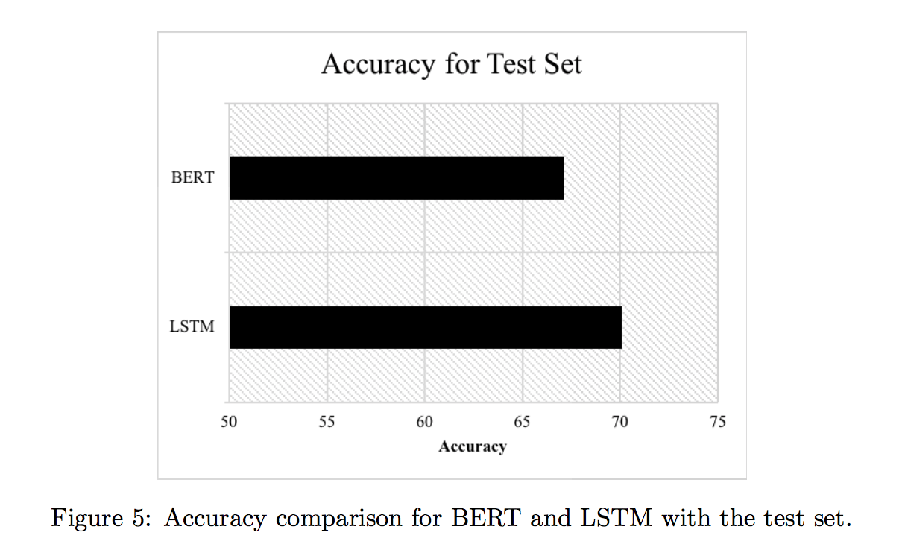

# BERT-vs-LSTM

Research paper link: https://arxiv.org/pdf/2009.05451.pdf

Paper Title: **`A Comparison of LSTM and BERT for Small Corpus`**

## Aim

Give a small dataset, can we use a large pre-trained model like BERT and get better results than simple models?

## Key points

- Results show that bidirectional LSTM model can achieve significantly higher results than a BERT model for a small dataset.

- Performance of a model is dependent on the task and the data, and therefore before making a model choice, these factors should be taken into consideration.

## Dataset used for Experiments

Intent classification dataset is used. It has 150 intent classes with 100 training observations from each class. For each intent, 20 validation and 30 test queries are provided. There are also out-of-scope queries that do not fall under any of the 150 intent classes.

<table align="center">
<th> Dataset </th>
<th> Number of Utterances </th>

<tr>
<td> Training </td>
<td> 15,101 </td>
</tr>

<tr>
<td> Validation </td>
<td> 3,101 </td>
</tr>

<tr>
<td> Test </td>
<td> 5,501 </td>
</tr>
</table>

**The models were tested on randomly splitted smaller versions by taking X percent of the data where X = {25, 40, 50, 60, 70, 80, 90}**

The number of out-of-scope utterances is very low compared to in-scope utterances and the number of classes are high compared to the number of observations available for each intent. Only a total of 1,200 out-of-scope utterances exist in the dataset, with 100 of them in the training set, 100 of them in the validation set and the remaining 1,000 out-of-scope utterances in the test set.

## Metrics

- `In-scope accuracy`: is calculated using only in-scope utterances before calculating the accuracy metric

- `Overall accuracy`: is a better metric for measuring the overall performance of the model as it does not remove the challenging utterances from the result and therefore is more realistic

In-scope accuracy results are higher than Overall accuracy results.

## Results

The simplest LSTM model(1 bidirectional + 1 unidirectional) performed the best in terms of both overall accuracy and in-scope accuracy.

- #### The experimental results show that LSTM outperforms BERT in every data partition

- #### One interesting finding is that, the difference in terms of accuracy between LSTM and BERT is much more when the dataset is small than when the dataset is larger

- #### With small datasets, simple models such as LSTM can perform better where complex models such as BERT may overfit.

- With the test set, in-score accuracy for the LSTM model was 69.65% and overall accuracy was 70.08% whereas BERT model achieved 67.15% accuracy

