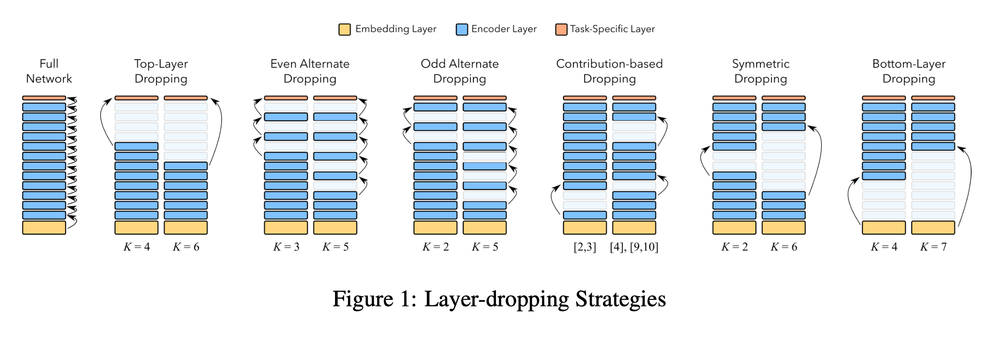
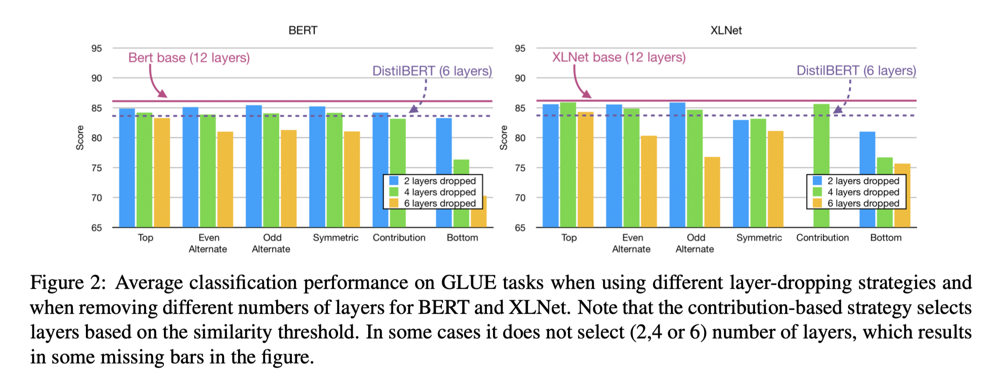
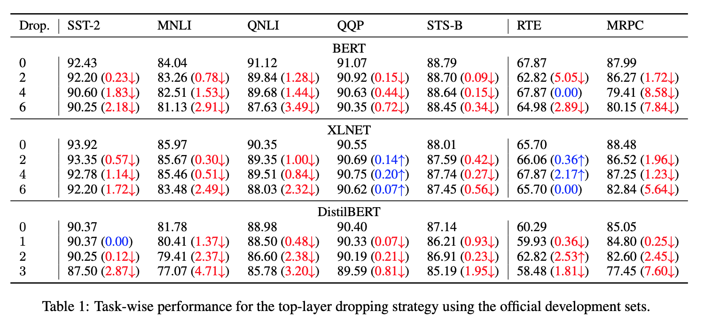
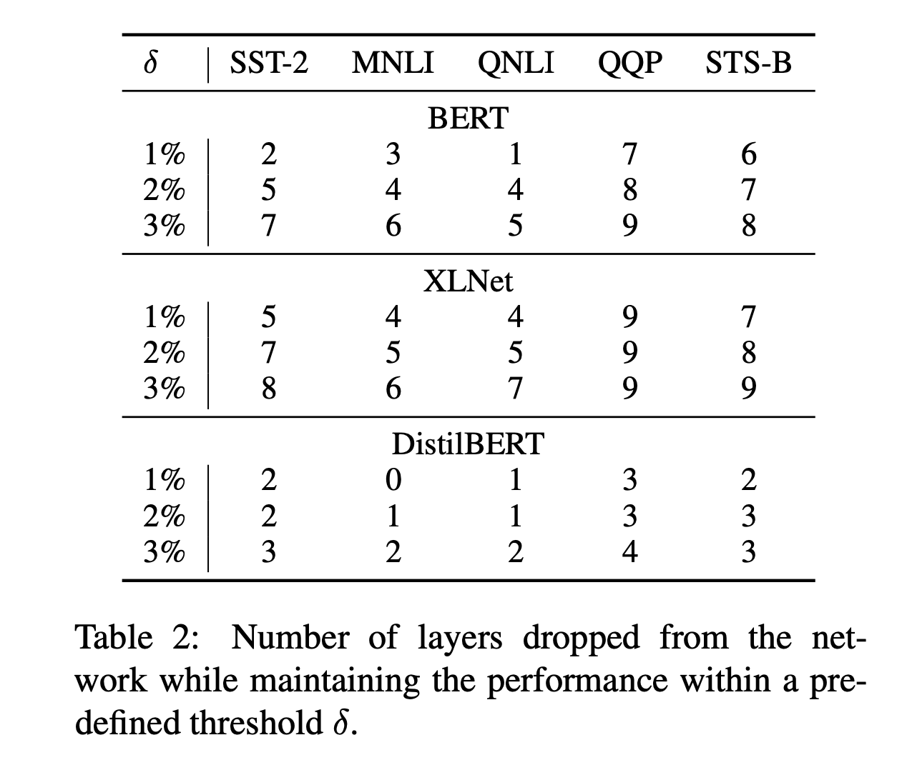
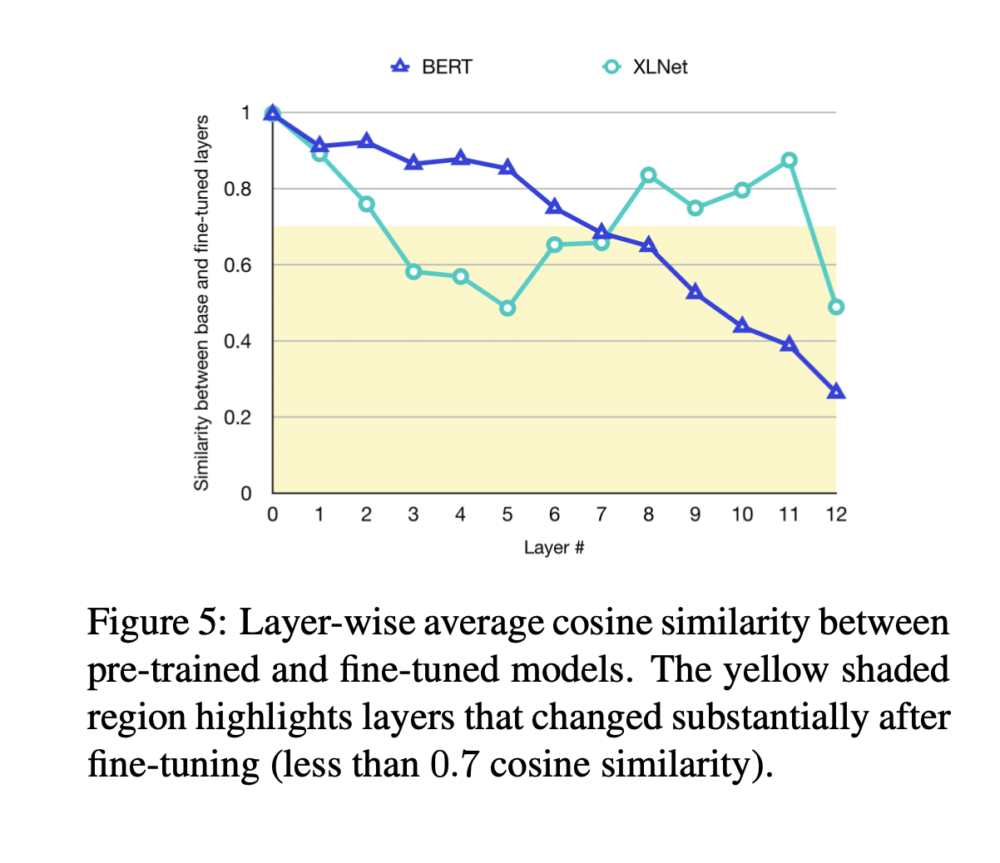
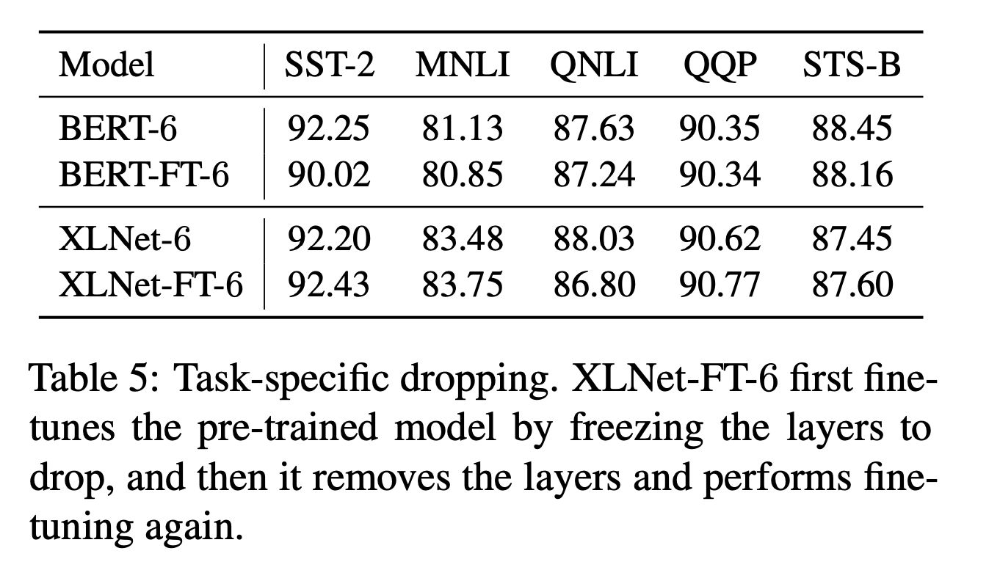

# Poor Man's BERT: Smaller and Faster Transformer Models

Research paper link: https://arxiv.org/pdf/2004.03844.pdf

## Aim

NLP has recently been dominated by large-scale pre-trained Transformer models, where size does matter. Models such as BERT, XLNet, RoBERTa, etc. are now out of reach for researchers and practitioners without large GPUs/TPUs. How to reduce the model size that do not require model pretraining from scratch?

**Knowledge distillation requires additional training after an already expensive teacher training** which limits the usefulness of these techniques to inference time.

An alternative method to knowledge distillation, which provides a simple solution is **pruning**. What would happen with model performance if we drop entire transfomer layers from the pre-trained model?

## Key points

**Pruning techniques**: To thoroughly examine the effect of dropping transformer layers, the authors propose five different strategies

- `Top-layer dropping`: Remove the top K layers of the network. [Previous work](https://arxiv.org/abs/1909.01380) has shown that later layers in the network specialize for the pre-training objective, which might not be helpful for downstream task.

- `Alternate dropping`: Deep neural networks are characterized by redundancy of information across the network. Neighbouring layers preserve similar information and it might be safe to drop alternate layers.

- `Contribution-based dropping`: This strategy is based on the idea that a layer contributing below a certain threshold might be a good candidate for dropping. This is measured by averaging the cosine similarity between input and output embeddings. It seems reasonable to remove layers where this similarity is high, as that would indicate small changes.

- `Symmetric dropping`: It is possible that both lower and higher layers are more important than the middle layers in a model.

- `Bottom-layer dropping`: Remove the initial layers of the network. This form is included for completeness. [Previous work](https://www.aclweb.org/anthology/N19-1112/) has shown that initial layers of the network model local interaction between words and word pieces (which is important for morphology and part of speech) thus providing essential input to higher-level layers.

#### The main benefit of these pruning techniques is that the resulting model does not require any further pre-training. The authors suggest that it is sufficient to only fine-tune the model on the specific task.

This allows practitioners without access to massive amounts of computing hardware to easily create smaller versions already existing, pre-trained models.

## Results

The above mentioned pruning methods were evaluated for three models:

- BERT (12 layers)
- XLNet (12 layers)
- DistilBERT (6 layers)

**Top-layer pruning** outperforms other pruning techniques on GLUE benchmark.

- Dropping half of the top layers (yellow bar in the top strategy) with an average loss of only 2.91 and 1.81 points for BERT and XLNet respectively.

- Dropping one-third of the network (i.e. 4 layers) resulted in a drop of only 2 points and 0.23 points for BERT and XLNet respectively (blue bar in the top strategy).

- Top-layer dropping layer strategy yiels comparable results to DistilBERT.

### Task wise results

- The Top-layer strategy works consistently well for all models

- For most of the tasks, we can safely drop half of the top layers in BERT, XLNet or DistilBERT at the cost of losing only 1-3 points.

#### How many layers are strictly necessary for each task?

- With XLNet, QQP maintains a performance within 1 point when dropping up to 9 top layers of the model.

- QNLI and the MNLI tasks are most sensitive to dropping layers across all models.

**To summarize, authors found that for 12-layer models, dropping top four layers works consistently well for all tasks with a loss of at most 2%.**

### Memory and Speed Comparision

By dropping half of the layers of the network, the average performance drops between 1.81–3.28 points, the number of `model parameters reduce by 40%` and the `fine-tuning and inference time reduces by 50%`

### BERT vs XLNet

How BERT and XLNet behaves towards pruning?

- XLNet is more robust to pruning of its top layers. This leads them to conclude that XLNet is able to learn more complex, task-specific information earlier in the network.

- The similarity between base and fine-tuned BERT models reduces from lower to higher layers.

- XLNet shows a completely different behavior. The middle layers undergo major changes while the lower and higher layers remain relatively close to the base model.

### Layer Dropping on Fine-tuned models

The authors first fine-tune the model, drop the layers, and then fine-tune the model again.

- The result shows that the method of dropping layers directly from a pre-trained model does not lose any critical information which was essential for a specific task.

- Pruning a fine-tuned model may lose task-specific information since after fine-tuning, the model is optimized for the task. This is reflected in some of the results of BERT/XLNet-FT-6.

## My Observations

- This seems like an effective technique for production scenarios. Since it requires less compute compared to distillation method and results are comparable to distil version.

- The paper suggests that this technique can act as complementary to distillation and quantization methods. Effect of combining all the techniques needs to be explored.

#### References

- [Dair AI blog on Poor Mans Bert](https://medium.com/dair-ai/poor-mans-bert-why-pruning-is-better-than-knowledge-distillation-%EF%B8%8F-f9652a1dc2bd)