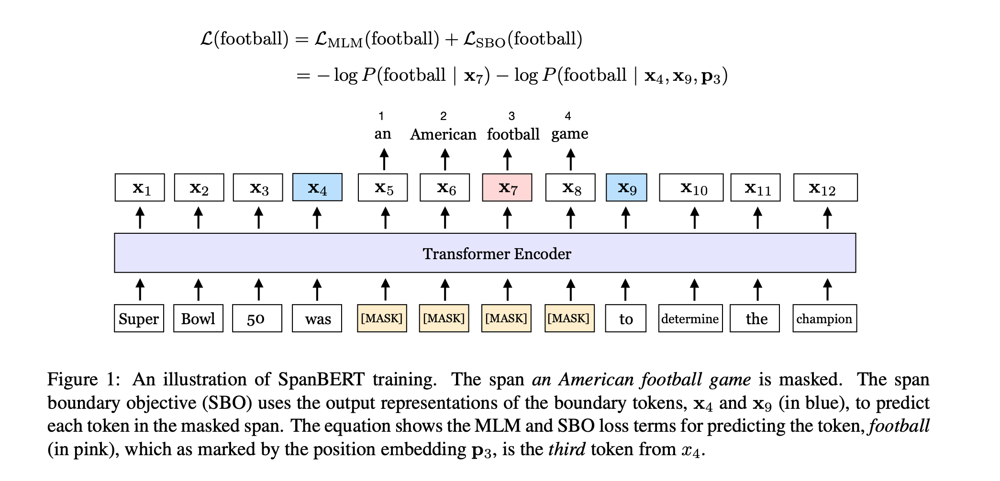
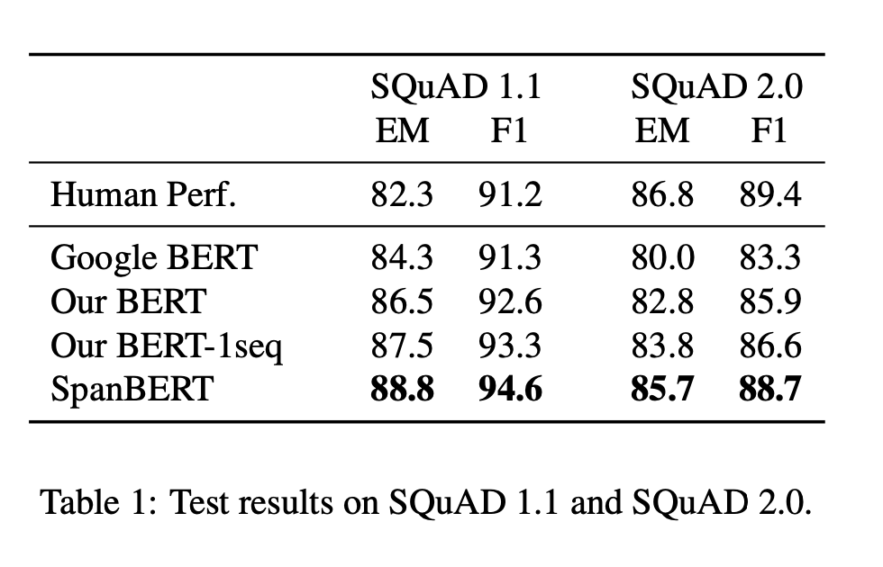
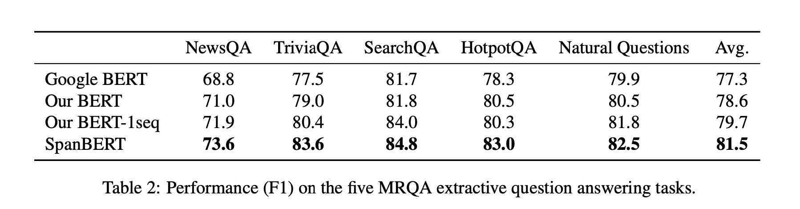
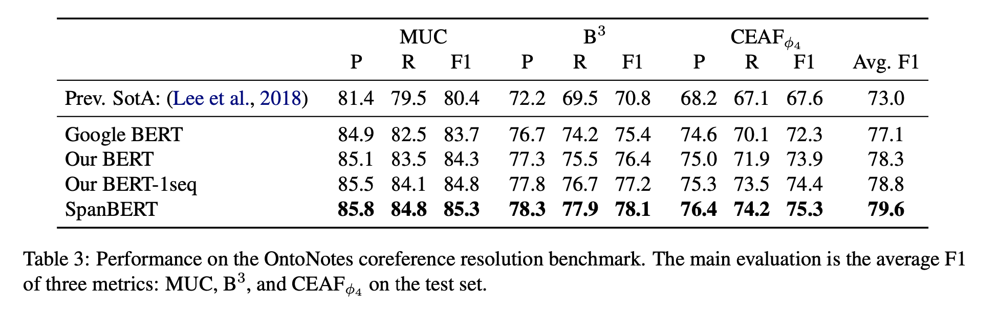
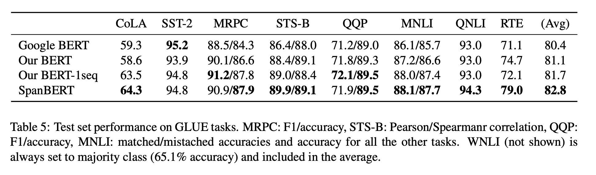
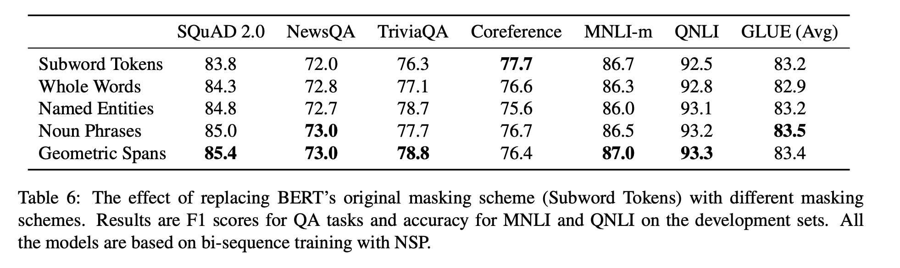
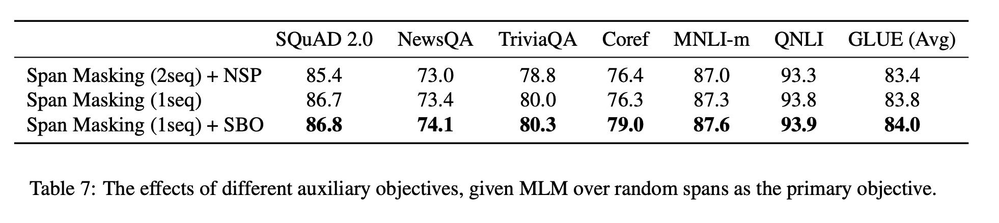

# SpanBERT

Research paper link: https://arxiv.org/pdf/1907.10529.pdf

Paper Title: **`SpanBERT: Improving Pre-training by Representing and Predicting Spans`**

## Aim

Pre-training objective plays an important role in learning the representations of language. BERT's pretraining objective contains 2 parts: Masked Language Modelling (MLM) and Next Sentence Prediction (NSP). This paper proposes new pre-training obejective which can better encode the sentences.

## Key points

Three pre-training methods were proposed.

- `Span Masking`: Instead of sampling random tokens (subwords), random spans(complete words) were masked.

- `Span Boundary Objective (SBO)`: This involves predicting each token of a masked span using only the representations of the observed tokens at the boundaries. This objective helps to better encode data which is required for span selection tasks. (Ex: Extractive Question Answering).

- `Single-Sequence Training`: BERT has NSP objective which involves whether second sequence follows the first sequence or not. This paper suggests that NSP objective is not useful for 2 reasons. (a) the model benefits from longer full-length contexts and(b) conditioning on, often unrelated, context from another document adds noise to the masked language model. Therefore in this method NSP is dropped and only single sentence is used.

The model architecture looks like this:

## Results

### Question Answering Tasks

On SQuAD dataset both 1.1 and 2.0, SpanBERT exceeds BERT performance.

On other question answering tasks also SpanBERT outperforms BERT. We can see the impact of removing NSP objective in BERT, but most of the improvement stems from span masking and span boundary objective.

### Coreference Resolution

On Coreference resolution task also SpanBERT improves over BERT.

### GLUE Benchmark

For most tasks, the different models appear to perform similarly. Moving to single-sequence training without the NSP objective substantially improves CoLA, and yields smaller (but considerable) improvements on MRPC and MNLI. The main gains from SpanBERT are in the SQuAD-based QNLI dataset (+1.3%) and in RTE (+6.9%), the latter accounting for most of the rise in SpanBERT’s GLUE average.

In summary:

- SpanBERT outperforms BERT in almost every task

- SpanBERT is especially better at extractive question answering

- Single-sequence training works considerably better than bi-sequence training with next sentence prediction (NSP)

## Ablation Studies

### Masking schemes

Authors compare random span masking scheme with masking of linguistically-informed spans.

- `Subword Tokens`: Sample random Word-piece tokens, as in the original BERT.

- `Whole Words`: Authors sample random words, and then mask all of the subword tokens in those words. The total number of masked subtokens is around 15%.

- `Named Entities`: At 50% of the time, sample from named entities in the text, and sample random whole words for the other 50%. Authors run spaCy’s named entity recognizer on the corpus and select all the non-numerical named entity mentions as candidates.

- `Noun Phrases`: Similar as Named Entities, authors sample from noun phrases at 50% of the time. The noun phrases are extracted by running spaCy’s constituency parser.

- `Geometric Spans`: Sample random spans from a geometric distribution, as in our SpanBERT.

#### Masking random spans is preferable to other strategies.

### Auxiliary Objectives

In order to check the importance of NSP and SBO objectives, model is trained with NSP, SBO and without anyone.

Unlike the NSP objective, SBO does not appear to have any adverse effects and actually improves performance.

## Conclusion

Choosing pre-training tasks that are closely related to downstream tasks can improve the model performance.