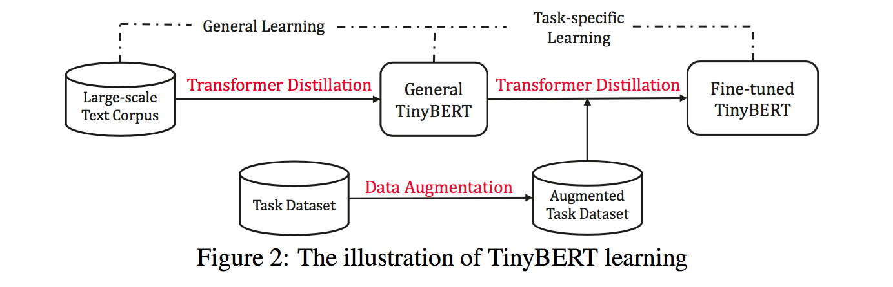
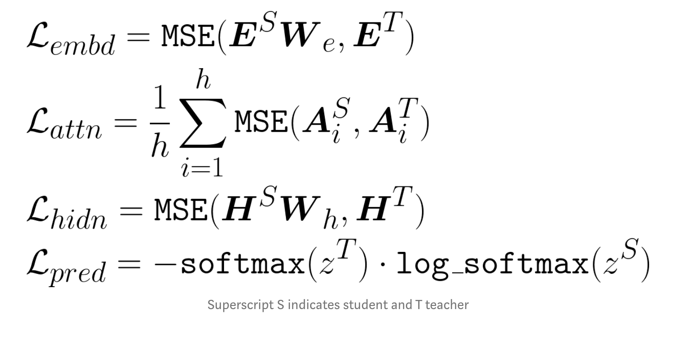
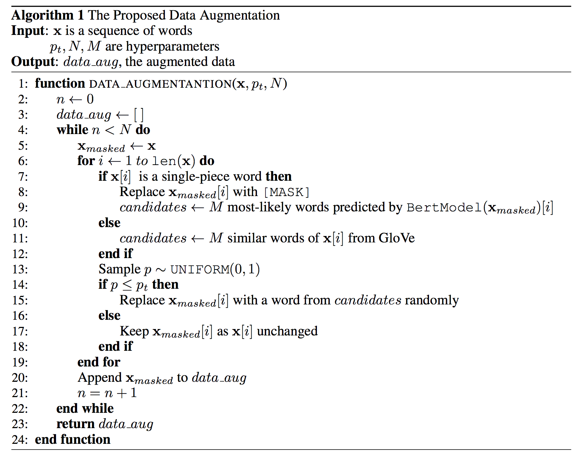
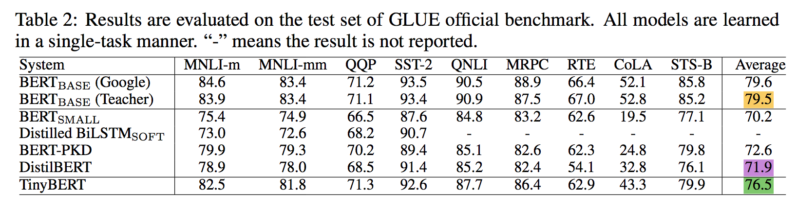
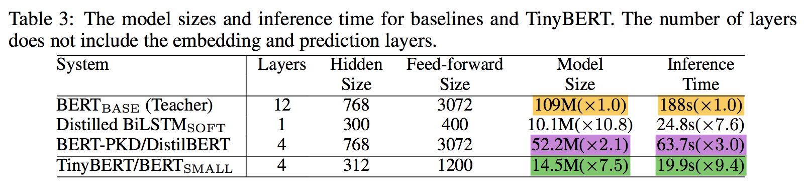
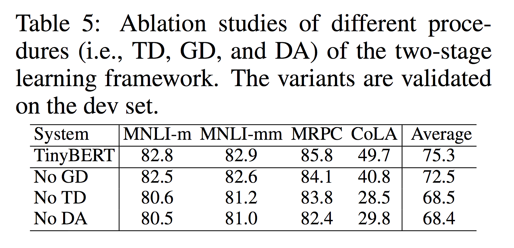
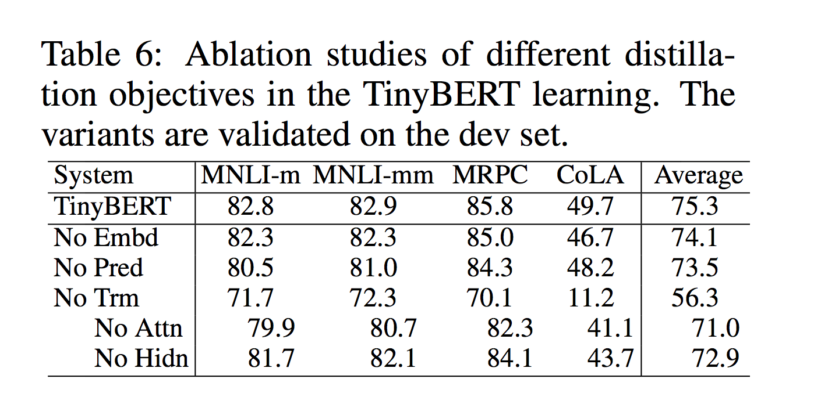

# TinyBERT: Distilling BERT for Natural Language Understanding

Research paper link: https://arxiv.org/pdf/1909.10351.pdf

## Aim

Pre-trained Language models(BERT) are usually computationally expensive and memory intensive, so it is difficult to effectively execute them on resource-restricted devices. How to reduce the size while keeping the performance drop to minimum?

## Key points

- A novel two-stage learning framework:
    - **`General Distillation`** : General distillation helps student TinyBERT learn the rich knowledge embedded in teacher BERT, which plays an important role in improving the generalization capability of TinyBERT

    - **`Task-Specific Distillation`** : The task-specific distillation teaches the student the task-specific knowledge

    With the two-step distillation, the gap between teacher (BERT) model and student (DistilBERT) model is further reduced.

- **`Data Augmentation`** : A data augmentation method is proposed to expand the task-specific training set.

## Two-stage Distillation

`General Distillation`: A set of loss functions designed to help the student learn from its teacher at a fine-grained level. These allow the student to observe how the teacher’s embedding layer, attention matrices, hidden representations, and prediction layer react given some input text.

*Note: Previous work such as DistillBERT only trained the student to replicate the teacher based on its output distribution which in comparison greatly reduces the knowledge transfer*

`Task-Specific Distillation`: The fine-tuning step switches teacher models to a task-specific one and continues to train the student. Initially, the training is limited to embedding and transformer layers (intermediate layer distillation), keeping the prediction layer fixed which eventually is unfrozen and trained for a smaller number of steps (prediction layer distillation).

## Data Augmentation

> Any data that tells us something about the teachers decision process is useful for distilling its knowledge.

They use a pre-trained BERT model (to replace sentence-piece tokens) and GloVe (for word-level tokens) to create alternate, highly probable versions of their input data. These are created through randomly selecting a subset of word/sentence-piece tokens from the dataset for which the helper models predict alternative tokens.

## Results

- `TinyBERT student Model`:
    - num_layers = 4
    - hidden_size = 312
    - feed_forward_size 1200
    - attention_heads = 12
    - **14.5M** parameters

- `BERT teacher Model`:
    - num_layers = 12
    - hidden_size = 768
    - feed_forward_size 3072
    - attention_heads = 12
    - **109M** parameters

Using the proposed techniques enable this TinyBERT model to achieve 96% (76.5 vs 79.5 points average) of its BERT base teacher on the GLUE benchmark while being 7.5x smaller and 9.4x faster!

TinyBERT significantly outperforms the state-of-the-art KD baselines (i.e., BERT-PKD and DistillBERT) by a margin of at least 3.9%, even with only ∼28% parameters and ∼31% inference time of baselines

## Ablation Studies

### Effects of different learning procedures

The proposed two-stage TinyBERT learning frame-work consists of three key procedures: 
- TD (Task-specific Distillation)
- GD (General Distillation)
- DA (Data Augmentation)

The results indicate that all the three procedures are crucial for the pro- posed KD(Knowledge distillation) method.

The task-specific procedures (TD and DA) are more helpful than the pre-training procedure (GD).

### Effects of different distillation objectives

Several baselines are proposed including the TinyBERT learning without the Transformer-layer distillation (No Trm), embedding-layer distillation (No Emb) and prediction-layer distillation (No Pred) respectively.

The results show that all the proposed distillation objectives are useful for the TinyBERT learning.

- The performance drops significantly from 75.3 to 56.3 under the setting (No Trm), which indicates `Transformer-layer distillation is the key` for TinyBERT learning.

- The attention based distillation has a bigger effect than hidden states based distillation on TinyBERT learning.

### References

- [dair.ai blog on TinyBERT](https://medium.com/dair-ai/tinybert-size-does-matter-but-how-you-train-it-can-be-more-important-a5834831fa7d)